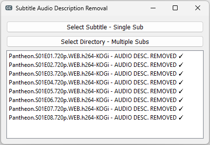

# Subtitle Audio Description Removal
- `SADR` removes the audio description like [Horns honking in distance], (Indistinct conversations) from the subtitles
- `Select Subtitle - Single Sub`
    - Able to select an `.srt` file
    - Typically ideal for movies
- `Select Directory - Multiple Subs`
    - In the added directory and all in it's subdirectories all the `.srt` files will be transformed
    - Typically ideal for series, TV shows
- Once the file or folder selected, the conversation and listing are triggered automatically
- The new subtitle is saved in the same folder of the original subtitle
- Double clicking in the result list:
    - Opens the directory of the selected subtitle in `File Explorer`

<div align="center">
    
</div>

## Requirements
### Python 3 - used: 3.11.5
- https://www.python.org/

### Install dependencies
``` pip install -r requirements.txt ```

### OS
- Tested on Windows 11

## Thank you all who worked on the modules used in this project!